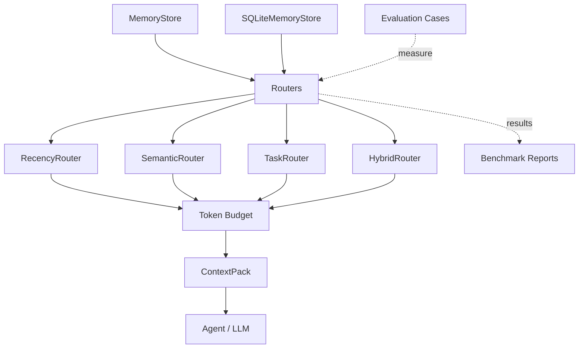

# context-router

**Route the right context to the right agent at the right time.**

`context-router` is a developer-grade Python reference implementation for agent systems that need to select relevant context instead of dumping every available memory into an LLM prompt.

## Problem statement

Most agent prototypes send too much context: full memory logs, unrelated notes, stale tasks, or every vector-search result. This increases cost, slows responses, and can make agents less accurate. Context routing treats memory selection as an explicit system layer:

- retrieve only context relevant to the current query
- balance semantic relevance with recency and importance
- package selected context in a structured `ContextPack`
- keep routing logic testable and swappable

## Architecture



Storage stays separate from routing: `MemoryStore` and `SQLiteMemoryStore` provide context items, routers rank them, token budgeting constrains selected items, and `ContextPack` is the final output boundary for an agent or LLM. Evaluation cases and benchmark reports sit alongside the routing layer to measure quality and context reduction over time.

## Project structure

```text
context_router/
├── router/
│   ├── recency_router.py
│   ├── semantic_router.py
│   ├── task_router.py
│   └── hybrid_router.py
├── context/
│   ├── memory_store.py
│   ├── context_pack.py
│   └── context_types.py
├── scoring/
│   ├── relevance.py
│   ├── recency.py
│   └── importance.py
├── examples/
│   ├── customer_assistant.py
│   ├── coding_agent.py
│   └── robotics_agent.py
└── demo.py
```

## Install

```bash
git clone https://github.com/aditya89bh/context-router.git
cd context-router
python -m pip install -e .[dev]
```

## Run the demo

```bash
python -m context_router.demo
python -m context_router.demo --query "Fix Docker build failure" --router hybrid
python -m context_router.demo --query "Recover failed CNC pickup" --router task
```

Example output:

```text
Query: Prepare for the customer automation meeting
Selected router: hybrid
Retrieved contexts:
  1. [customer] Customer meeting prep: Acme Manufacturing wants a low-risk automation rollout...
  2. [customer] Open customer action items: confirm stakeholder list and ROI estimate...
ContextPack summary: ContextPack(router=hybrid, items=3, categories=['customer', ...])
```

## Router comparison

| Router | Selection strategy | Best for | Tradeoff |
|---|---|---|---|
| `RecencyRouter` | newest items first | live assistants, latest state | ignores semantic fit |
| `SemanticRouter` | embedding similarity | natural-language retrieval | can surface stale/unimportant context |
| `TaskRouter` | inferred task category | predictable domain routing | depends on category taxonomy |
| `HybridRouter` | weighted semantic + recency + importance | production-style routing | requires score tuning |

Hybrid formula:

```text
final_score = 0.5 * semantic + 0.3 * recency + 0.2 * importance
```

## Context objects

```python
ContextItem(
    id="coding-docker",
    text="Docker build failure: base image mismatch...",
    timestamp=now,
    category="coding",
    importance=0.95,
)
```

`ContextPack` returns selected memories, short summaries, and routing metadata for downstream agents.

## Examples

```bash
python context_router/examples/customer_assistant.py
python context_router/examples/coding_agent.py
python context_router/examples/robotics_agent.py
```

Expected routing behavior:

- `"Prepare for the customer automation meeting"` → customer memories
- `"Fix Docker build failure"` → coding memories
- `"Recover failed CNC pickup"` → robotics memories


## Production usage path

### Public API imports

```python
from datetime import datetime, timezone

from context_router import ContextItem, ContextPack, HybridRouter, MemoryStore

store = MemoryStore()
store.add(
    ContextItem(
        id="incident-docker",
        text="Docker build fails when the base image misses libpq dependencies.",
        timestamp=datetime.now(timezone.utc),
        category="coding",
        importance=0.9,
    )
)

router = HybridRouter(store, top_k=3)
ranked = router.route("Fix Docker build failure")
pack = ContextPack.from_scored(ranked, query="Fix Docker build failure", router=router.name)
```

### Token budget example

```python
pack = ContextPack.from_scored(
    ranked,
    query="Fix Docker build failure",
    router=router.name,
    max_tokens=120,
)
print(pack.metadata["estimated_tokens"])
```

CLI equivalent:

```bash
python -m context_router.demo --query "Fix Docker build failure" --router hybrid --max-tokens 120
```

### Evaluation command

```bash
python -m context_router.evaluation
python -m context_router.benchmark
```

### SQLite store example

```python
from context_router.context.sqlite_memory_store import SQLiteMemoryStore

store = SQLiteMemoryStore("context.db")
store.add(context_item)
recent = store.get_recent(top_k=5)
store.close()
```

### From demo to production

1. Replace demo data with domain-specific `ContextItem` records.
2. Use a durable store such as `SQLiteMemoryStore` or a future vector/database adapter.
3. Tune `HybridRouter` weights with `RouterConfig` and evaluation cases.
4. Apply token budgets at the `ContextPack` boundary before prompt assembly.
5. Track benchmark metrics in CI or release checks.

## Semantic embeddings

`SemanticRouter` supports sentence-transformers models. For tests and offline demos, it defaults to a deterministic hashing embedding model to avoid network/model downloads.

Production usage:

```python
from context_router.scoring.relevance import load_sentence_transformer
from context_router.router.semantic_router import SemanticRouter

model = load_sentence_transformer("all-MiniLM-L6-v2")
router = SemanticRouter(store, top_k=5, model=model)
```

## Benchmark section

See [`RESULTS.md`](RESULTS.md) for sample routing outputs and context reduction examples.

| Query | Total memories | Routed memories | Reduction |
|---|---:|---:|---:|
| Customer meeting | 7 | 3 | 57% |
| Docker build | 7 | 3 | 57% |
| CNC pickup | 7 | 3 | 57% |

## Test

```bash
pytest
```

The repository includes coverage for recency routing, semantic routing, task routing, hybrid routing, scoring functions, and context pack creation.

## Future roadmap

- persistent stores: SQLite, Postgres, Redis
- vector DB adapters: FAISS, Qdrant, Chroma
- learned task classifiers
- feedback-based importance updates
- token-budget-aware `ContextPack` compression
- router evaluation harness with precision/recall metrics
- MCP/server mode for agent frameworks

## License

MIT-ready; add a license file if you plan to publish it as open source.
